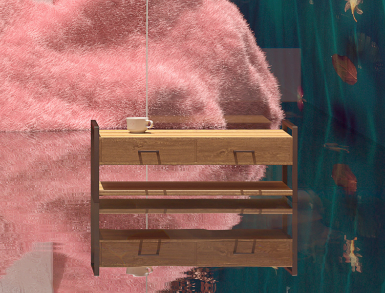

<!DOCTYPE html>
<html lang="en" class="no-js">

<head>
    <meta charset="UTF-8" />
    <meta http-equiv="X-UA-Compatible" content="IE=edge">
    <meta name="viewport" content="width=device-width, initial-scale=1">
    <title>LiVi Lite Prototpye</title>
    <meta name="description" content="An experimental interactive room slideshow based on the prototype concept by Bilal Mechairia's Dribbble shot 'Spaces'" />
    <meta name="keywords" content="room, slideshow, 3d, perspective, animation, css, javascript, web development" />
    <meta name="author" content="Codrops" />
    <link rel="shortcut icon" href="favicon.ico">
    <link rel="stylesheet" type="text/css" href="css/normalize.css" />
    <link rel="stylesheet" type="text/css" href="fonts/icomoon/icomoon.css" />
    <link rel="stylesheet" type="text/css" href="css/demo.css" />
    <link rel="stylesheet" type="text/css" href="css/component.css" />
    <link rel="stylesheet" type="text/css" href="css/animations.css" />
    
    

    
</head>

<body>
    <header class="codrops-header">
        
    </header>

    <body>
        
View on a larger screen to see the 3D display

        
Your browser does not support preserve-3d!

        

            

                

                    

                        

                            

                        

                        

                            

                        

                    

                

            

            

                

                    

                        

                            
                            

                                
                                

                                    <h3 class="item__title">Product Launch</h3>
                                    <!--                                 

 -->
                                    <iframe src="https://giphy.com/embed/xT39Div8FqzcSnf5hm" height="200" frameBorder="0" class="giphy-embed" allowFullScreen></iframe>
                                    <h3 class="item__title">Celebrity Interview</h3>
                                    <!--                                 

 -->
                                    <iframe src="https://giphy.com/embed/hqa4GZT80Q2KSerdwj" height="200" frameBorder="0" class="giphy-embed" allowFullScreen></iframe>
                                

                                <button class="button button--close"><i class="icon icon--close"></i>Close</button>
                            

                            

                                
                                

                                    <h3 class="item__title join-title">Join Jessica in a Live Demo now!</h3>
                                    <!--                                 
$39
 -->
                                    <a href="https://zoom.us/j/93246617969?pwd=SjVsbCtYWVNrZllDVDhRV0JnMXBJdz09" target="blank" class=" button-join"> Join Now </a>
                                

                                <button class="button button--close"><i class="icon icon--close"></i>Close</button>
                            

                        

                        

                            
                            

                                
                                

                                    
Expansion in Shanghai

                                    
By 2040, global energy demand is projected to increase by 25 percent, and, much like today, China and the Asia Pacific region will drive much of that growth.

                                        
 As economies there expand and living standards improve, more consumers will buy refrigerators, televisions or automobiles, which all use materials made from byproducts of oil and gas.
                                    

                                

                                <button class="button button--close"><i class="icon icon--close"></i>Close</button>
                            

                        

                    

                

            

            

                

                    

                        

                            
                            

                                
                                

                                    <iframe title="Our Process" width="480" height="300" src="https://marseille.laphase5.com/en" id="api-frame" allow="autoplay;fullscreen;xr-spatial-tracking" allowfullscreen=""></iframe>
                                

                                <button class="button button--close"><i class="icon icon--close"></i>Close</button>
                            

                        

                        

                            
                            

                                
                                

                                    <iframe title="Modern device of MRI 3D model - Sketchfab" class="c-viewer__iframe" width="480" height="300" src="https://sketchfab.com/models/74bc0dea266c4b228fcee69da6535330/embed?autostart=1&amp;internal=1&amp;ui_infos=0&amp;ui_snapshots=1&amp;ui_stop=0&amp;ui_watermark=0"
                                        id="api-frame" allow="autoplay;fullscreen;xr-spatial-tracking" allowfullscreen=""></iframe>
                                

                                <button class="button button--close"><i class="icon icon--close"></i>Close</button>
                            

                        

                    

                

            

            

                

                    

                        

                            <iframe src=" https://player.vimeo.com/video/476944210?autoplay=1&muted=1" width="1080" height="600" frameborder=“0” allowfullscreen allow=autoplay></iframe>
                        

                        

                            <iframe src="https://vimeo.com/live-chat/525142088/edb00cbe2a" width="340" height="600" frameborder="0"></iframe>
                        

                    

                

            

            <nav class="nav">
                <a href="#" class="nav__item">The Master Bedroom</a>
                <a href="#" class="nav__item">The Dining Room</a>
                <a href="#" class="nav__item">The Bathroom</a>
                <a href="#" class="nav__item">The Office</a>
            </nav>
            

                <h2 class="title">Welcome to LiVi Lite Explore our solution</h2>
                <h2 class="title">What is LiVi Lite?What it does</h2>
                <h2 class="title">The Benefits How it delivers</h2>
                <h2 class="title">Use Cases Where this works</h2>
            

        

        <!-- /container -->
        
        
        
    </body>

</html>